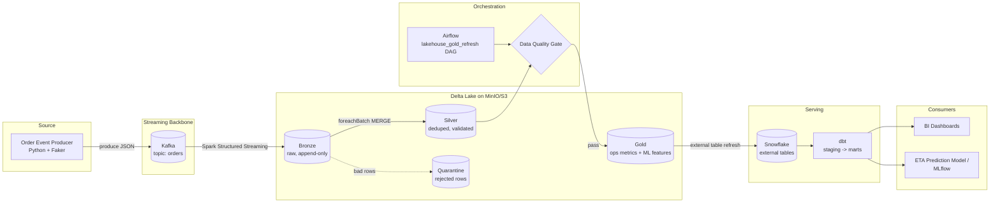

# Real-Time Streaming Lakehouse

An end-to-end streaming data platform that simulates a DoorDash-style order
lifecycle, lands it through a medallion (Bronze/Silver/Gold) architecture on
Delta Lake, gates it with automated data-quality checks, serves it into
Snowflake via dbt, and feeds an ML feature table for ETA prediction — all
orchestrated by Airflow.

Built to demonstrate the same patterns used in production streaming +
lakehouse systems: exactly-once-ish streaming ingestion, idempotent
upserts, data-quality gating, and a clean batch/streaming split.

## Architecture



**Why this shape:**
- **Bronze is immutable** — Silver/Gold can always be rebuilt from it. No cleaning logic ever runs against the raw Kafka payload directly.
- **Silver enforces contracts** — null keys, bad timestamps, and negative values are quarantined, not silently dropped or coerced. Dedup uses a `MERGE` keyed on `(order_id, status)` so replays are idempotent.
- **The DQ gate sits between Silver and Gold**, not after Gold — a bad batch never gets a chance to look like a valid business metric.
- **Streaming vs. batch split**: Bronze/Silver are long-running Structured Streaming jobs (sub-minute latency); Gold is a scheduled Airflow batch job, because rolling BI metrics don't need sub-minute freshness and batch is cheaper/more debuggable.

## Repo layout

```
producer/                Kafka event producer (simulated order stream)
spark/jobs/               01_bronze_ingest.py, 02_silver_transform.py, 03_gold_aggregate.py
spark/schemas/            Shared PySpark schemas
dbt/models/staging/       Views over Snowflake external tables (Gold)
dbt/models/marts/         fct_eta_features (ML), dim_restaurant_daily_performance (BI)
airflow/dags/             lakehouse_gold_refresh.py
great_expectations/       dq_checks.py — DQ suite run inside the Airflow DAG
docker-compose.yml         Kafka, Zookeeper, MinIO, Spark, Airflow, Postgres
```

## Quickstart

```bash
cp .env.example .env
docker compose up -d --build

# 1. start the two streaming jobs (each is a long-running process)
docker compose exec spark-master spark-submit \
  --packages io.delta:delta-spark_2.12:3.1.0,org.apache.spark:spark-sql-kafka-0-10_2.12:3.5.0 \
  /opt/spark-apps/jobs/01_bronze_ingest.py &

docker compose exec spark-master spark-submit \
  --packages io.delta:delta-spark_2.12:3.1.0 \
  /opt/spark-apps/jobs/02_silver_transform.py &

# 2. start producing events
pip install -r requirements.txt
python producer/order_event_producer.py --rate 20 --dirty-pct 0.05

# 3. Airflow UI: http://localhost:8090 (admin/admin) — triggers Gold + dbt on a schedule
# 4. Kafka UI: http://localhost:8085
# 5. MinIO console: http://localhost:9001 (minioadmin/minioadmin)
```

dbt needs real Snowflake credentials (`dbt/profiles.yml.example` → `~/.dbt/profiles.yml`)
since Gold is exposed to Snowflake via external tables — this repo doesn't
spin up a local Snowflake, so `dbt run`/`dbt test` are meant to be run once
you point them at a real (even free-tier) Snowflake account.

## What this project demonstrates

| Concern | Where |
|---|---|
| Streaming ingestion (Kafka → Structured Streaming) | `spark/jobs/01_bronze_ingest.py` |
| Idempotent upserts / exactly-once semantics | `spark/jobs/02_silver_transform.py` (Delta `MERGE`) |
| Data quality gating in a DAG | `great_expectations/dq_checks.py`, `airflow/dags/lakehouse_gold_refresh.py` |
| ML feature engineering (point-in-time correctness) | `spark/jobs/03_gold_aggregate.py`, `dbt/models/marts/fct_eta_features.sql` |
| Lakehouse → warehouse serving pattern | `dbt/models/staging/sources.yml` (external tables) |
| Orchestration & alerting | `airflow/dags/lakehouse_gold_refresh.py` (Slack on failure) |

## Possible extensions
- Swap the custom `dq_checks.py` for a full Great Expectations Checkpoint + Data Docs site.
- Add a Feast/Tecton-style online feature store fed from `gold.eta_model_features` for real-time model serving.
- Add Terraform for the MinIO/S3 buckets + Snowflake external stage, for a fully IaC-managed environment.
- Swap MinIO for real AWS S3 / Azure ADLS to demo the multi-cloud angle.
